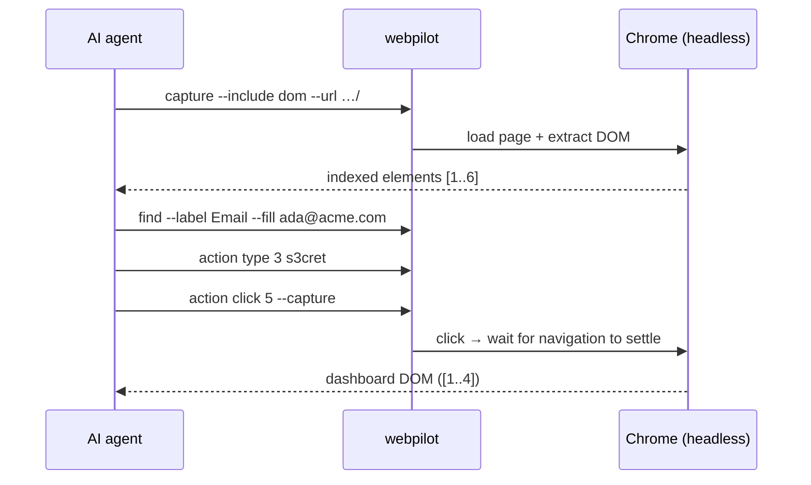
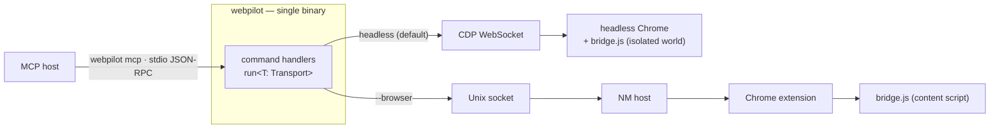

# WebPilot

[](https://github.com/junyeong-ai/web-pilot/actions)
[](https://www.rust-lang.org)

> **English** | **[한국어](README.md)**

**A Chrome browser-control CLI for AI agents.** Read a page (DOM / screenshot / text), click and type, watch network and console traffic, and manage sessions and cookies — all from one-line commands, without ever opening a browser yourself. No setup: Chrome launches automatically.

---

## Why WebPilot?

- **Zero setup** — one command and you're going. `webpilot capture --include dom --url URL` launches Chrome for you.
- **AI-native output** — the page is compressed into a token-efficient **indexed element list**, with semantic search (`find`) and typed errors that carry guidance.
- **Headless + SSO** — headless by default. Add `--browser` and it drives your **real, logged-in Chrome** (SSO sessions included).
- **Persistent session** — Chrome stays warm after the first launch; every later command reconnects (you pay the launch cost only once).
- **Single binary · built-in MCP** — the CLI, the Native Messaging host, and an **MCP server** (`webpilot mcp`) all live in one binary and share one engine.

---

## Quick Start — a 5-minute walkthrough

The examples below target a hypothetical internal task-tracker, **“Acme Tasks”** (login → dashboard).
**Every output shown here is a real capture.**

```bash
# 1. Install (binary download + checksum verification + interactive setup)
curl -fsSL https://raw.githubusercontent.com/junyeong-ai/web-pilot/main/scripts/install.sh | bash
```

### ① Open a page and see what's on it

```bash
webpilot capture --include dom --url "http://localhost:8700/"
```

```
[1] a "Acme Tasks" href="/" @navigation
[2] input#email "you@acme.com" label="Email" type=email autocomplete=email @form
[3] input#pw label="Password" type=password autocomplete=current-password @form
[4] input#remember label="Remember me" value="on" type=checkbox @form
[5] button "Sign in" @form
[6] a "Forgot password?" href="/reset.html" @main
--- Page: Acme Tasks — Sign in (http://localhost:8700/) ---
--- Scroll: entire page visible ---
--- 6 elements (from 20 nodes, 0ms) ---
```

Only the clickable/typable elements are picked out and listed with a **`[number]`** — and that number is the argument to every action that follows. (The last line shows it distilled 20 HTML nodes down to the 6 that matter.)

### ② Fill in the login form

Find the email field by its label and type into it in one step (`find --fill`); enter the password by index.

```bash
webpilot find --label "Email" --fill "ada@acme.com"
```
```
[2] input#email "you@acme.com" @form
(1 matches)
```

```bash
webpilot action type 3 "s3cret"
```
```
OK
```

### ③ Click Sign in — and capture the next page in the same step

Add `--capture` and WebPilot **waits for the navigation to settle**, then shows you the page it landed on.

```bash
webpilot action click 5 --capture
```
```
[1] a "Acme Tasks" href="/" @navigation
[2] a "Sign out" href="/logout.html" @navigation
[3] button#new "New task" @main
[4] input#q "Filter tasks" label="Filter tasks" type=search @main
--- Page: Acme Tasks — Dashboard (http://localhost:8700/dashboard.html) ---
--- Scroll: entire page visible ---
--- 4 elements (from 16 nodes, 1ms) ---
```

The login succeeded, we're on the **dashboard**, and the indices have been renumbered for the new page.

> **Indices are always bound to the *last* capture.** `[3]` points at the dashboard's “New task” button you just captured. Using an old index after the page changed doesn't silently re-resolve against the live DOM — it fails cleanly with a `StaleSnapshot` error (exit code 4). Acting on the wrong element is ruled out by construction.

The same flow as a diagram:



---

## How it works

`webpilot` is a **single binary**, and command handlers are written **once** as `run<T: Transport>`. Which `Transport` is used decides the mode.



- **Headless (default)** — the CLI drives a headless Chrome over CDP directly, and `bridge.js` runs in its own isolated world, auto-loaded on every document.
- **Browser (`--browser`)** — Unix socket → Native Messaging host → extension → content script, controlling your **real, logged-in Chrome**.
- **MCP (`webpilot mcp`)** — just a stdio JSON-RPC adapter over the **same** `Transport` and handlers, so there's no second engine.

The same `bridge.js` serves both modes, and a parity test fails the build if the two modes ever drift apart.

---

## DOM output format

```
*[1] input#query "Search" type=text autocomplete=search @search
[2] button "Go" @search
--- Page: Example (https://example.com) ---
--- Scroll: 25% (0.5 above, 1.2 below) ---
--- 6 elements (from 120 nodes, 5ms) ---
```

| Marker | Meaning |
|---|---|
| `[N]` | Element index — the argument to `action click N`. **Bound to the last capture snapshot.** |
| `*` | Element **new** since the previous capture (by node identity; not shown on the first capture in a new document). |
| `#id` | HTML element id. |
| `"text"` | Human-readable label (accessible name / placeholder / …). |
| `@ctx` | ARIA landmark (navigation · main · banner · form · search …). |
| Last line | Extracted-element count / total node count / elapsed time. |

Extra footers for iframes and shadow DOM (`--- N iframe(s) not shown ---`, `--- shadow DOM clipped … ---`) appear when relevant, so the agent knows the list may have been truncated.

---

## Features

### Page capture

```bash
webpilot capture --include dom --url "http://localhost:8700/"   # indexed DOM list (default)
webpilot capture --include text                                 # visible text only
webpilot capture --include screenshot                           # viewport PNG (saved to file)
webpilot capture --include screenshot --full-page               # the whole scrollable page in one shot
webpilot capture --include screenshot --annotate                # numbered labels drawn on elements
webpilot capture --include pdf                                  # PDF rendering
webpilot capture --include dom text screenshot                  # several at once (JSON output)
```

Screenshots, PDFs, and the accessibility tree are saved to files, and the path is reported:

```
Page: http://localhost:8700/
Title: Acme Tasks — Sign in
Screenshot: …/artifacts/capture_20536_…_0.png
Screenshot size: 1280x577
```

With `--annotate` or `--bounds`, each element's coordinates come along too:

```
[5] button "Sign in" bounds=(551,107,57,21) @form
```

### Find + act

```bash
webpilot find --role button                          # search by role
webpilot find --text "Sign in" --click               # find by text and click (when exactly one matches)
webpilot find --label "Email" --fill "ada@acme.com"  # find by label and fill
webpilot action click 5                              # click by index
webpilot action type 3 "s3cret" --clear              # type (clearing first)
webpilot action key-press Enter                      # key press (Tab · Escape · Arrow* …)
webpilot action select 2 "Option B"                  # choose a <select> option
webpilot action scroll-to 7                          # scroll until an element is in view
webpilot action upload 4 ./resume.pdf                # upload a file
```

`find` shows the matching elements, and `--click`/`--fill` only act when **exactly one** matches:

```
[5] button "Sign in" @form
(1 matches)
```

`key-press`, `hover`, and `click` go in as native CDP input rather than synthetic events, so Tab actually moves focus and Enter submits a form.

### Network & console monitoring

Arm a monitor, then read back what the page did. Here, clicking the dashboard's “New task” button:

```bash
webpilot console start
webpilot network start
webpilot action click 3        # the button fires console.log + fetch
webpilot console read
webpilot network read
```
```
[1781409477045] [log] refreshing tasks
```
```
[1781409477046] fetch GET /tasks.json → 200 (1ms)
```

> Monitors report **from when they were (re)armed**, and best-effort only for a cooperative page (the hooks live in the MAIN world, so an adversarial page can evade them). Never treat an empty buffer as proof nothing happened.

### Sessions · cookies · authenticated requests

```bash
webpilot cookie list "http://localhost:8700/"                    # read cookies
webpilot session export --output session.json                    # save cookies + localStorage
webpilot session import session.json                             # restore a session
webpilot fetch "http://localhost:8700/api/me" \
  --method POST --header content-type:application/json --body '{}'  # request with session cookies
```

### Evaluate JavaScript

```bash
webpilot eval "document.querySelectorAll('input').length"
```
```
3
```

### Device emulation (headless only)

```bash
webpilot device preset iphone-15                       # preset device
webpilot device set --width 390 --height 844 --mobile  # custom viewport
webpilot device reset                                  # clear emulation
```

---

## Two modes — headless vs browser

| | Headless (default) | Browser (`--browser`) |
|---|---|---|
| Target Chrome | A separate headless Chrome WebPilot launches | Your **real, logged-in Chrome** |
| SSO / session | None (clean profile) | Reuses your existing SSO/login sessions |
| Path | Direct CDP WebSocket | NM host (0600 socket) → extension |
| Multi-agent | Isolated via `--context <name>` | Single agent |
| Prerequisites | None | Extension + NM host registration (below) |

```bash
# Set up browser mode — one `setup` does skill + extension + NM host (extension id auto-detected)
webpilot setup
# Load the printed path via chrome://extensions → Developer mode → "Load unpacked" (the one manual step)

# Use it
webpilot --browser status                      # confirm connected
webpilot --browser capture --include dom

# Multi-agent isolation (headless)
webpilot --context agent-1 capture --include dom --url "http://localhost:8700/"
webpilot --context agent-2 capture --include dom --url "http://localhost:8700/"
```

---

## MCP server

Expose the same engine to any MCP host — with no second implementation.

```bash
webpilot mcp                  # stdio JSON-RPC (MCP) server. --browser / --context still apply
```

A curated subset of commands is offered as `browser_*` tools, inheriting the CLI's exact mode, policy, and rendering.

---

## Safety policy

WebPilot's policy gates operations by **effect**. The recommended **least-privilege** mode locks the baseline to `deny`, then allowlists only what's needed.

```bash
webpilot policy default deny                              # lock everything down
webpilot policy set --operation eval --verdict allow      # allow only the effects you need
webpilot policy list                                      # inspect the current rules
```
```
default: deny
eval: allow
```

A blocked operation fails cleanly with guidance and **exit code 6**:

```bash
webpilot action click 5      # under default deny
```
```
Blocked by policy: click. Check: webpilot policy list
```

- `eval` is the **master key**. With `eval` allowed, page JS can reproduce other effects, so narrow denies on `navigate` / `fetch` / `cookie_list` are merely advisory. **Deny `eval` first.**
- Policy is enforced at the **single sink that reaches the browser** (headless: `LocalTransport::send`; browser: the NM host). The host **re-parses** every wire value into a typed `Command` before checking, so a “Rust rejects / JS coerces” bypass is impossible.
- The policy store lives under the **durable data root** (`policy/policies.json`), not the OS cache — so a cache wipe can't silently reset your deny rules to allow.

> Policy is a **guardrail against a steered agent**, not a sandbox against a malicious same-user process. The store and `webpilot policy` belong to the same user the agent runs as — protect them externally if that boundary matters.

---

## Output modes

| Situation | Behavior |
|---|---|
| **Terminal** | Human messages to stderr, content to stdout |
| **Piped** | stdout not a TTY → automatic JSON |
| **Forced** | the `--json` flag |

The same `status` command becomes JSON when piped:

```bash
webpilot status | jq
```
```json
{
  "chrome_version": "149.0.7827.104",
  "connected": true,
  "context": null,
  "extension_version": null,
  "mode": "headless",
  "tab_title": "Acme Tasks — Sign in",
  "tab_url": "http://localhost:8700/"
}
```

---

## Installation

### Automatic (recommended)

```bash
curl -fsSL https://raw.githubusercontent.com/junyeong-ai/web-pilot/main/scripts/install.sh | bash
```

It downloads the prebuilt binary and SHA-256 checksum, verifies them, installs to `~/.local/bin/webpilot`, and unpacks the skill/extension assets **embedded in the binary at compile time** via `webpilot setup` — no repository clone required.

```bash
# Build from source (inside a checkout; rust-toolchain.toml pins the toolchain → rustup installs it)
WEBPILOT_BUILD=source bash scripts/install.sh

# Uninstall — a one-liner symmetric to the install
curl -fsSL https://raw.githubusercontent.com/junyeong-ai/web-pilot/main/scripts/uninstall.sh | bash
```

| Env var | Default | Meaning |
|---|---|---|
| `WEBPILOT_BUILD` | `prebuilt` | `prebuilt` (release download) or `source` (`cargo build`) |
| `WEBPILOT_VERSION` | latest | pin a release tag (prebuilt) |
| `WEBPILOT_INSTALL_DIR` | `$HOME/.local/bin` | install path |
| `WEBPILOT_REPO` | `junyeong-ai/web-pilot` | override when using a fork |
| `WEBPILOT_NO_SETUP=1` | — | skip the automatic `webpilot setup` after install |

---

## Command reference

| Command | Description |
|---|---|
| `capture --include <…>` | Capture page state (dom · text · screenshot · pdf · accessibility) |
| `action <click\|type\|key-press\|navigate\|scroll\|select\|upload\|hover\|focus\|drag\|…>` | Browser actions |
| `find --role/--text/--label/--placeholder [--click\|--fill]` | Semantic element search (+ act) |
| `eval <js>` | Evaluate JS in the page context |
| `wait <selector\|text\|navigation\|idle>` | Wait for a condition |
| `tab <switch\|new\|close\|find>` | Tab management |
| `frame <switch\|url\|find\|main>` | iframe switching |
| `dom <set-html\|set-text\|set-attr\|get-html\|get-text\|get-attr>` | Read/write DOM |
| `fetch <url>` | Request a URL with the session cookies |
| `network <start\|read\|clear>` | Network request monitor |
| `console <start\|read\|clear>` | Console output capture |
| `cookie <list\|get\|set\|delete>` | Cookie management |
| `session <export\|import>` | Export/import session (cookies + localStorage) |
| `device <set\|preset\|reset>` | Device viewport / UA emulation (headless) |
| `diff --dom\|--screenshot` | Compare snapshots |
| `policy <default\|set\|list\|clear>` | Effect-keyed operation gate |
| `context <list\|close>` | Multi-agent isolation contexts |
| `status` | Check connection status |
| `mcp` | Run the MCP server (stdio) |
| `setup` / `self update` / `uninstall` | Install lifecycle |
| `quit` | Stop the headless Chrome session |

See `webpilot <command> --help` for the full options of each.

### Common global flags

- `--browser` — drive your real, logged-in Chrome (NM path) instead of headless
- `--context <name>` — multi-agent isolation context (headless)
- `--json` — force JSON output (automatic when piped)
- `-v, --verbose` — debug logging to stderr

---

## Exit codes

| Code | Meaning |
|---|---|
| `0` | Success |
| `1` | General / session error |
| `2` | CLI usage error (unknown flag, non-numeric index, …) |
| `3` | Infrastructure (`ConnectionLost` · `BridgeUnavailable` · `VersionMismatch`) |
| `4` | Not found (`ElementNotFound` · `StaleSnapshot` · `SelectorNotFound` · `TabNotFound` · `ContextNotFound` · `CookieNotFound` · `FrameNotFound`) |
| `5` | `Timeout` |
| `6` | `PolicyDenied` (blocked by policy) |
| `7` | `InvalidArgument` (user input error) |
| `8` | Navigation (`NavigationFailed` · `NoPage`) |

Errors print with guidance text, and in JSON mode come out as `{"code": "...", "message": "...", ...}` — you can branch on `code` without parsing strings.

---

## Lifecycle

```bash
webpilot setup                 # interactive setup: skill + extension + NM host (id auto-detected; one manual "Load unpacked")
webpilot setup skill           # (re)install just the skill
webpilot setup extension       # extract the extension + Chrome guide (opens chrome://extensions)
webpilot setup nm-host         # register the NM host (extension id auto-detected; --extension-id overrides for a different build)

webpilot self update           # self-update to the latest release (atomic, sha256-verified)
webpilot self update --version X.Y.Z   # pin a version

webpilot quit                  # stop the headless Chrome session
webpilot uninstall             # quit Chrome + remove everything the binary created
```

The skill and extension are embedded in the binary at compile time, so the **bundled assets always match the binary** — no post-install download. If an extension already loaded in your browser is stale after an update, the host catches it at connect time with `VersionMismatch` and prompts a reload. After setup, Claude Code activates the skill via `/webpilot` or plain natural language.

---

## Troubleshooting

```bash
webpilot status                # connection state / Chrome version / active tab
webpilot -v capture --include dom --url URL   # debug logging to stderr
webpilot quit && webpilot status              # restart when a session gets stuck
```

- **`VersionMismatch` (code 3)** — the installed extension version differs from the bundled one. Run `webpilot setup extension`, then reload the extension.
- **`StaleSnapshot` (code 4)** — the element an index pointed at left the DOM. Re-run `capture`.
- **Headless Chrome won't launch (container/CI)** — where the setuid sandbox can't initialize, opt in with `WEBPILOT_CHROME_NO_SANDBOX=1` (it weakens the sandbox, so it's off by default).

---

## Support

- [GitHub Issues](https://github.com/junyeong-ai/web-pilot/issues)
- Developer guide: `CLAUDE.md` in the repo (root + per-crate progressive disclosure)

---

<div align="center">

**English** | **[한국어](README.md)**

Made with Rust

</div>
