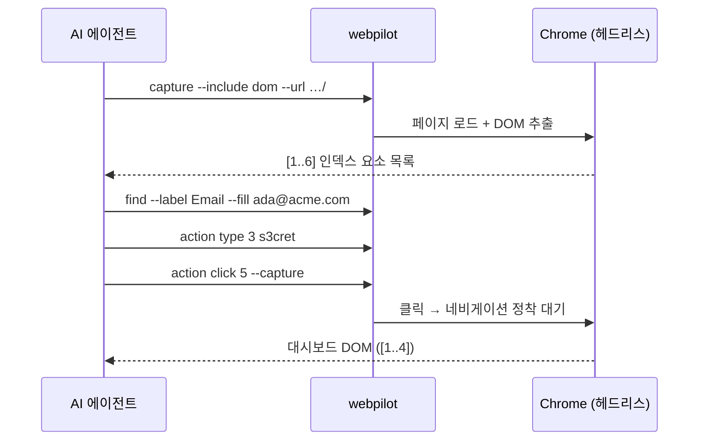
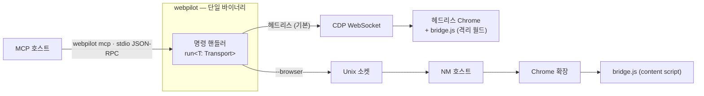

# WebPilot

[](https://github.com/junyeong-ai/web-pilot/actions)
[](https://www.rust-lang.org)

> **[English](README.en.md)** | **한국어**

**AI 에이전트를 위한 Chrome 브라우저 제어 CLI.** 페이지를 읽고(DOM·스크린샷·텍스트), 클릭·입력하고, 네트워크·콘솔을 관찰하고, 세션·쿠키를 다루는 일을 브라우저를 직접 띄우지 않고 한 줄 명령으로 수행합니다. 별도 설정 없이 Chrome이 자동으로 뜹니다.

---

## 왜 WebPilot인가?

- **설정 제로** — 첫 명령 한 줄이면 끝. `webpilot capture --include dom --url URL` 하면 Chrome이 알아서 뜹니다.
- **AI 친화적 출력** — 페이지를 토큰 효율적인 **인덱스 요소 목록**으로 압축해서 보여주고, 의미 기반 검색(`find`)과 가이드가 담긴 타입 에러를 제공합니다.
- **헤드리스 + SSO** — 기본은 헤드리스. `--browser`를 붙이면 로그인된 **실제 Chrome**(SSO 세션 포함)을 그대로 제어합니다.
- **세션 유지** — Chrome은 한 번 떠서 계속 살아 있고, 이후 명령은 매번 재접속합니다(기동 비용은 처음 한 번만).
- **단일 바이너리 · MCP 내장** — CLI / Native Messaging 호스트 / **MCP 서버**(`webpilot mcp`)가 하나의 바이너리에 들어 있고, 셋 다 같은 엔진을 공유합니다.

---

## 빠른 시작 — 5분 따라하기

아래 예시는 가상의 사내 할 일 관리 앱 **“Acme Tasks”**(로그인 → 대시보드)를 대상으로 합니다.
**여기 나오는 모든 출력은 실제 캡처 결과입니다.**

```bash
# 1. 설치 (바이너리 다운로드 + 체크섬 검증 + 대화형 setup)
curl -fsSL https://raw.githubusercontent.com/junyeong-ai/web-pilot/main/scripts/install.sh | bash
```

### ① 페이지 열고 무엇이 있는지 보기

```bash
webpilot capture --include dom --url "http://localhost:8700/"
```

```
[1] a "Acme Tasks" href="/" @navigation
[2] input#email "you@acme.com" label="Email" type=email autocomplete=email @form
[3] input#pw label="Password" type=password autocomplete=current-password @form
[4] input#remember label="Remember me" value="on" type=checkbox @form
[5] button "Sign in" @form
[6] a "Forgot password?" href="/reset.html" @main
--- Page: Acme Tasks — Sign in (http://localhost:8700/) ---
--- Scroll: entire page visible ---
--- 6 elements (from 20 nodes, 0ms) ---
```

페이지의 클릭·입력 가능한 요소만 골라 **`[번호]`** 가 붙은 목록으로 보여줍니다. 이 번호가 이어지는 모든 동작의 인자가 됩니다. (HTML 노드 20개 중 의미 있는 6개만 추렸다는 점도 마지막 줄에서 알 수 있습니다.)

### ② 로그인 폼 채우기

라벨로 이메일 칸을 찾아 바로 입력하고(`find --fill`), 비밀번호는 인덱스로 입력합니다.

```bash
webpilot find --label "Email" --fill "ada@acme.com"
```
```
[2] input#email "you@acme.com" @form
(1 matches)
```

```bash
webpilot action type 3 "s3cret"
```
```
OK
```

### ③ 로그인 버튼 클릭 — 그리고 다음 페이지를 바로 캡처

`--capture`를 붙이면 클릭으로 일어난 **네비게이션이 정착할 때까지 기다렸다가** 도착한 페이지를 곧바로 보여줍니다.

```bash
webpilot action click 5 --capture
```
```
[1] a "Acme Tasks" href="/" @navigation
[2] a "Sign out" href="/logout.html" @navigation
[3] button#new "New task" @main
[4] input#q "Filter tasks" label="Filter tasks" type=search @main
--- Page: Acme Tasks — Dashboard (http://localhost:8700/dashboard.html) ---
--- Scroll: entire page visible ---
--- 4 elements (from 16 nodes, 1ms) ---
```

로그인에 성공해 **대시보드**로 넘어왔고, 인덱스가 새 페이지 기준으로 다시 매겨졌습니다.

> **인덱스는 항상 “마지막 capture” 기준입니다.** `[3]`은 방금 캡처한 대시보드의 “New task” 버튼을 가리킵니다. 페이지가 바뀐 뒤 옛 인덱스를 쓰면 라이브 DOM에 다시 맞추는 게 아니라 `StaleSnapshot` 에러(종료 코드 4)로 명확히 실패합니다 — 잘못된 요소를 건드리는 사고가 구조적으로 차단됩니다.

이 흐름을 그림으로 보면:



---

## 작동 방식

`webpilot`는 **단일 바이너리**이며, 명령 핸들러는 `run<T: Transport>`로 **한 번만** 작성됩니다. 어느 `Transport`를 쓰느냐가 모드를 결정합니다.



- **헤드리스(기본)** — CLI가 CDP로 헤드리스 Chrome을 직접 몰고, `bridge.js`는 페이지마다 자동 로드되는 자기만의 격리 월드에서 돕니다.
- **브라우저(`--browser`)** — Unix 소켓 → Native Messaging 호스트 → 확장 → content script 경로로 **로그인된 실제 Chrome**을 제어합니다.
- **MCP(`webpilot mcp`)** — 위와 **똑같은** `Transport`·핸들러 위에 stdio JSON-RPC 어댑터만 얹은 것이라, 별도 엔진이 없습니다.

같은 `bridge.js`가 두 모드에 동일하게 쓰이고, 두 모드가 갈라지지 않도록 패리티 테스트가 빌드에서 강제됩니다.

---

## DOM 출력 형식

```
*[1] input#query "Search" type=text autocomplete=search @search
[2] button "Go" @search
--- Page: Example (https://example.com) ---
--- Scroll: 25% (0.5 above, 1.2 below) ---
--- 6 elements (from 120 nodes, 5ms) ---
```

| 표기 | 의미 |
|---|---|
| `[N]` | 요소 인덱스 — `action click N`의 인자. **마지막 capture 스냅샷에 고정**됩니다. |
| `*` | 직전 capture 이후 **새로 생긴** 요소 (노드 식별자 기준; 새 문서의 첫 capture에서는 표시하지 않음). |
| `#id` | HTML 요소 id. |
| `"텍스트"` | 접근성 이름 / 플레이스홀더 등 사람이 읽는 라벨. |
| `@ctx` | ARIA 랜드마크 (navigation · main · banner · form · search …). |
| 마지막 줄 | 추출 요소 수 / 전체 노드 수 / 소요 시간. |

iframe·shadow DOM 관련 추가 푸터(`--- N iframe(s) not shown ---`, `--- shadow DOM clipped … ---`)도 필요할 때 함께 표시되어, 목록이 일부 잘렸는지 에이전트가 알 수 있습니다.

---

## 주요 기능

### 페이지 캡처

```bash
webpilot capture --include dom --url "http://localhost:8700/"   # 인덱스 DOM 목록 (기본)
webpilot capture --include text                                 # 보이는 텍스트만
webpilot capture --include screenshot                           # 뷰포트 PNG (파일로 저장)
webpilot capture --include screenshot --full-page               # 스크롤 전체를 한 장에
webpilot capture --include screenshot --annotate                # 요소에 번호 라벨을 그려서 캡처
webpilot capture --include pdf                                  # PDF 렌더링
webpilot capture --include dom text screenshot                  # 한 번에 여러 개 (JSON 출력)
```

스크린샷·PDF·접근성 트리는 파일로 저장되고, 경로를 알려줍니다:

```
Page: http://localhost:8700/
Title: Acme Tasks — Sign in
Screenshot: …/artifacts/capture_20536_…_0.png
Screenshot size: 1280x577
```

`--annotate`나 `--bounds`를 쓰면 각 요소의 좌표가 함께 나옵니다:

```
[5] button "Sign in" bounds=(551,107,57,21) @form
```

### 찾기 + 동작

```bash
webpilot find --role button                          # 역할로 검색
webpilot find --text "Sign in" --click               # 텍스트로 찾아 바로 클릭 (정확히 1개일 때)
webpilot find --label "Email" --fill "ada@acme.com"  # 라벨로 찾아 바로 입력
webpilot action click 5                              # 인덱스로 클릭
webpilot action type 3 "s3cret" --clear              # 입력 (기존 값 비우고)
webpilot action key-press Enter                      # 키 입력 (Tab·Escape·Arrow* 등)
webpilot action select 2 "Option B"                  # <select> 옵션 선택
webpilot action scroll-to 7                          # 요소가 보일 때까지 스크롤
webpilot action upload 4 ./resume.pdf                # 파일 업로드
```

`find`는 조건에 맞는 요소를 보여주고, `--click`/`--fill`은 **정확히 하나** 일치할 때만 동작합니다:

```
[5] button "Sign in" @form
(1 matches)
```

`key-press`·`hover`·`click`은 합성 이벤트가 아니라 네이티브 CDP 입력으로 들어가, Tab은 실제로 포커스를 옮기고 Enter는 폼을 제출합니다.

### 네트워크 · 콘솔 관찰

모니터를 켜둔 뒤(arm) 페이지가 일으킨 활동을 읽습니다. 아래는 대시보드에서 “New task” 버튼을 눌렀을 때:

```bash
webpilot console start
webpilot network start
webpilot action click 3        # 버튼이 console.log + fetch 를 일으킴
webpilot console read
webpilot network read
```
```
[1781409477045] [log] refreshing tasks
```
```
[1781409477046] fetch GET /tasks.json → 200 (1ms)
```

> 모니터는 **재무장 시점 이후**의 활동만, 그리고 협조적인 페이지에 한해 best-effort로 보고합니다(MAIN 월드 훅이라 적대적 페이지는 우회 가능). 빈 버퍼를 “아무 일도 없었다”는 증거로 삼지 마세요.

### 세션 · 쿠키 · 인증 요청

```bash
webpilot cookie list "http://localhost:8700/"                    # 쿠키 읽기
webpilot session export --output session.json                    # 쿠키 + localStorage 저장
webpilot session import session.json                             # 세션 복원
webpilot fetch "http://localhost:8700/api/me" \
  --method POST --header content-type:application/json --body '{}'  # 세션 쿠키로 인증 요청
```

### 자바스크립트 평가

```bash
webpilot eval "document.querySelectorAll('input').length"
```
```
3
```

### 기기 에뮬레이션 (헤드리스 전용)

```bash
webpilot device preset iphone-15                       # 프리셋 기기
webpilot device set --width 390 --height 844 --mobile  # 커스텀 뷰포트
webpilot device reset                                  # 에뮬레이션 해제
```

---

## 두 가지 모드 — 헤드리스 vs 브라우저

| | 헤드리스 (기본) | 브라우저 (`--browser`) |
|---|---|---|
| 대상 Chrome | WebPilot이 띄우는 별도 헤드리스 Chrome | 당신이 쓰는, **로그인된 실제 Chrome** |
| SSO / 세션 | 없음(깨끗한 프로필) | 기존 SSO·로그인 세션 그대로 사용 |
| 경로 | CDP WebSocket 직결 | NM 호스트(0600 소켓) → 확장 |
| 멀티 에이전트 | `--context <이름>`으로 격리 | 단일 에이전트 |
| 사전 준비 | 없음 | 확장 + NM 호스트 등록(아래) |

```bash
# 브라우저 모드 준비
webpilot setup extension                       # 확장 추출 + Chrome 안내 (chrome://extensions 열림)
webpilot setup nm-host --extension-id <ID>     # Native Messaging 호스트 등록

# 사용
webpilot --browser capture --include dom

# 멀티 에이전트 격리 (헤드리스)
webpilot --context agent-1 capture --include dom --url "http://localhost:8700/"
webpilot --context agent-2 capture --include dom --url "http://localhost:8700/"
```

---

## MCP 서버

같은 엔진을 어떤 MCP 호스트에든 그대로 노출합니다 — 두 번째 구현이 없습니다.

```bash
webpilot mcp                  # stdio JSON-RPC (MCP) 서버. --browser / --context 도 그대로 적용
```

curated된 명령 일부가 `browser_*` 툴로 제공되며, CLI와 동일한 모드·정책·렌더링을 물려받습니다.

---

## 안전 정책 (policy)

WebPilot의 정책은 **효과(effect)** 기준으로 동작을 게이트합니다. 기본을 `deny`로 잠근 뒤 필요한 것만 허용(allowlist)하는 **최소 권한** 모드가 권장됩니다.

```bash
webpilot policy default deny                              # 전부 잠금
webpilot policy set --operation eval --verdict allow      # 필요한 효과만 허용
webpilot policy list                                      # 현재 규칙 확인
```
```
default: deny
eval: allow
```

차단된 동작은 가이드와 함께 **종료 코드 6**으로 명확히 실패합니다:

```bash
webpilot action click 5      # default deny 상태
```
```
Blocked by policy: click. Check: webpilot policy list
```

- `eval`은 **마스터 키**입니다. `eval`이 허용되면 페이지 JS로 다른 효과를 재현할 수 있으니, `navigate`·`fetch`·`cookie_list` 같은 좁은 deny는 보조적일 뿐입니다. **`eval`을 먼저 막으세요.**
- 정책은 **브라우저에 닿는 단 하나의 sink**(헤드리스: `LocalTransport::send`, 브라우저: NM 호스트)에서만 강제됩니다. 호스트는 모든 와이어 값을 타입 있는 `Command`로 **다시 파싱**한 뒤 검사하므로 “Rust는 거부, JS는 강제 변환” 식 우회가 불가능합니다.
- 정책 저장소는 OS 캐시가 아니라 **영속 데이터 루트**(`policy/policies.json`)에 있어, 캐시 정리로 deny 규칙이 슬그머니 풀리지 않습니다.

> 정책은 **방향이 틀어진 에이전트에 대한 가드레일**이지, 같은 사용자 권한의 악성 프로세스를 막는 샌드박스가 아닙니다. 저장소와 `webpilot policy`는 에이전트와 같은 사용자 소유입니다 — 그 경계가 중요하다면 외부에서 보호하세요.

---

## 출력 모드

| 상황 | 동작 |
|---|---|
| **터미널** | 사람용 메시지는 stderr, 콘텐츠는 stdout |
| **파이프** | stdout이 TTY가 아니면 자동으로 JSON |
| **강제** | `--json` 플래그 |

같은 `status` 명령도 파이프로 넘기면 JSON으로 바뀝니다:

```bash
webpilot status | jq
```
```json
{
  "chrome_version": "149.0.7827.104",
  "connected": true,
  "context": null,
  "extension_version": null,
  "mode": "headless",
  "tab_title": "Acme Tasks — Sign in",
  "tab_url": "http://localhost:8700/"
}
```

---

## 설치

### 자동 설치 (권장)

```bash
curl -fsSL https://raw.githubusercontent.com/junyeong-ai/web-pilot/main/scripts/install.sh | bash
```

릴리스의 사전 빌드 바이너리와 SHA-256 체크섬을 내려받아 검증한 뒤 `~/.local/bin/webpilot`에 설치하고, 바이너리에 **컴파일 타임에 임베드된** 스킬·확장 자산을 `webpilot setup`으로 풀어 줍니다 — 저장소를 clone할 필요가 없습니다.

```bash
# 소스에서 빌드 (체크아웃 안에서; rust-toolchain.toml 이 툴체인을 고정 → rustup 이 설치)
WEBPILOT_BUILD=source bash scripts/install.sh

# 제거 — 설치한 것과 대칭인 한 줄
curl -fsSL https://raw.githubusercontent.com/junyeong-ai/web-pilot/main/scripts/uninstall.sh | bash
```

| 환경변수 | 기본값 | 의미 |
|---|---|---|
| `WEBPILOT_BUILD` | `prebuilt` | `prebuilt`(릴리스 다운로드) 또는 `source`(`cargo build`) |
| `WEBPILOT_VERSION` | latest | 릴리스 태그 고정(prebuilt) |
| `WEBPILOT_INSTALL_DIR` | `$HOME/.local/bin` | 설치 경로 |
| `WEBPILOT_REPO` | `junyeong-ai/web-pilot` | 포크 사용 시 override |
| `WEBPILOT_NO_SETUP=1` | — | 설치 후 자동 `webpilot setup` 생략 |

---

## 명령어 참조

| 명령어 | 설명 |
|---|---|
| `capture --include <…>` | 페이지 상태 캡처 (dom · text · screenshot · pdf · accessibility) |
| `action <click\|type\|key-press\|navigate\|scroll\|select\|upload\|hover\|focus\|drag\|…>` | 브라우저 동작 |
| `find --role/--text/--label/--placeholder [--click\|--fill]` | 의미 기반 요소 검색(+동작) |
| `eval <js>` | 페이지 컨텍스트에서 JS 평가 |
| `wait <selector\|text\|navigation\|idle>` | 조건 대기 |
| `tab <switch\|new\|close\|find>` | 탭 관리 |
| `frame <switch\|url\|find\|main>` | iframe 전환 |
| `dom <set-html\|set-text\|set-attr\|get-html\|get-text\|get-attr>` | DOM 읽기/쓰기 |
| `fetch <url>` | 세션 쿠키로 URL 요청 |
| `network <start\|read\|clear>` | 네트워크 요청 모니터 |
| `console <start\|read\|clear>` | 콘솔 출력 캡처 |
| `cookie <list\|get\|set\|delete>` | 쿠키 관리 |
| `session <export\|import>` | 세션(쿠키+localStorage) 내보내기/가져오기 |
| `device <set\|preset\|reset>` | 기기 뷰포트·UA 에뮬레이션 (헤드리스) |
| `diff --dom\|--screenshot` | 스냅샷 비교 |
| `policy <default\|set\|list\|clear>` | 효과 기준 동작 게이트 |
| `context <list\|close>` | 멀티 에이전트 격리 컨텍스트 |
| `status` | 연결 상태 확인 |
| `mcp` | MCP 서버(stdio) 실행 |
| `setup` / `self update` / `uninstall` | 설치 라이프사이클 |
| `quit` | 헤드리스 Chrome 세션 종료 |

전체 옵션은 `webpilot <command> --help`로 확인하세요.

### 공통 글로벌 플래그

- `--browser` — 헤드리스 대신 로그인된 실제 Chrome(NM 경로) 제어
- `--context <이름>` — 멀티 에이전트 격리 컨텍스트(헤드리스)
- `--json` — JSON 출력 강제 (파이프 시 자동)
- `-v, --verbose` — stderr 디버그 로그

---

## 종료 코드

| 코드 | 의미 |
|---|---|
| `0` | 성공 |
| `1` | 일반 / 세션 오류 |
| `2` | CLI 사용법 오류 (알 수 없는 플래그, 숫자가 아닌 인덱스 등) |
| `3` | 인프라 (`ConnectionLost` · `BridgeUnavailable` · `VersionMismatch`) |
| `4` | 찾지 못함 (`ElementNotFound` · `StaleSnapshot` · `SelectorNotFound` · `TabNotFound` · `FrameNotFound` …) |
| `5` | `Timeout` |
| `6` | `PolicyDenied` (정책 차단) |
| `7` | `InvalidArgument` (사용자 입력 오류) |
| `8` | 네비게이션 (`NavigationFailed` · `NoPage`) |

에러는 가이드 텍스트와 함께 출력되며, JSON 모드에서는 `{"code": "...", "message": "...", ...}` 구조로 나옵니다 — 문자열 파싱 없이 `code`로 분기할 수 있습니다.

---

## 라이프사이클

```bash
webpilot setup                 # 대화형 setup: 스킬 + 확장 + NM 호스트
webpilot setup skill           # 스킬만 (재)설치
webpilot setup extension       # 확장 추출 + Chrome 안내 (chrome://extensions 열림)
webpilot setup nm-host --extension-id <ID>

webpilot self update           # 최신 릴리스로 자가 업데이트 (atomic, sha256 검증)
webpilot self update --version X.Y.Z   # 버전 고정

webpilot quit                  # 헤드리스 Chrome 세션 종료
webpilot uninstall             # Chrome 종료 + 바이너리가 만든 모든 흔적 제거
```

스킬과 확장은 컴파일 타임에 바이너리에 임베드되어 **버전 드리프트가 발생할 수 없고**, 설치 후 추가 다운로드가 없습니다. setup 이후 Claude Code에서 `/webpilot` 또는 자연어로 스킬이 활성화됩니다.

---

## 문제 해결

```bash
webpilot status                # 연결 상태 / Chrome 버전 / 활성 탭 확인
webpilot -v capture --include dom --url URL   # stderr 디버그 로그
webpilot quit && webpilot status              # 세션이 꼬였을 때 재시작
```

- **`VersionMismatch` (코드 3)** — 설치된 확장 버전이 번들 버전과 다름. `webpilot setup extension` 후 확장을 리로드하세요.
- **`StaleSnapshot` (코드 4)** — 인덱스가 가리키던 요소가 DOM에서 사라짐. 다시 `capture` 하세요.
- **헤드리스 Chrome이 안 뜸 (컨테이너/CI)** — setuid 샌드박스가 초기화되지 않는 환경에서는 `WEBPILOT_CHROME_NO_SANDBOX=1`로 옵트인하세요(샌드박스를 약화시키므로 기본은 꺼져 있음).

---

## 지원

- [GitHub Issues](https://github.com/junyeong-ai/web-pilot/issues)
- 개발자 가이드: 저장소의 `CLAUDE.md` (루트 + 각 크레이트별 progressive disclosure)

---

<div align="center">

**[English](README.en.md)** | **한국어**

Made with Rust

</div>
